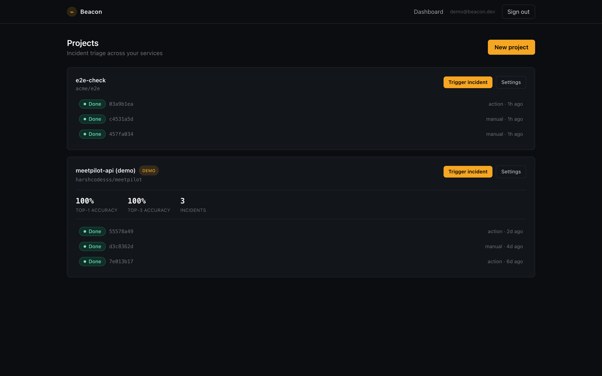

# Beacon

**AI incident triage for on-call engineers.** When a deploy fails at 3 AM,
Beacon reads the logs, metrics, and recent commits, investigates competing
root-cause hypotheses with real tool calls, and hands you an evidence-cited
report — before you have opened a terminal.


## How it works

1. **Collect** — clusters the trailing log window, flags brand-new error
   templates, and pulls recent deploy diffs; ~50K lines compressed to signal.
2. **Investigate** — generates competing root-cause hypotheses, then verifies
   each with real tool calls (`search_logs`, `read_diff`, `get_metric`) under
   a hard per-incident budget (tool calls and tokens both capped).
3. **Report** — delivers an evidence-cited report: root cause, confidence,
   what was ruled out and why, with every citation deterministically verified.

Reports land in the dashboard, and optionally in your inbox and on the
failing pull request via the [GitHub Action](INSTALL.md).


## Five-minute quickstart

Prerequisites: Docker with Compose.

```bash
git clone https://github.com/harshcodesss/Beacon.git
cd Beacon
cp .env.example .env   # defaults work out of the box for local demo
docker compose up --build
```

Compose boots five services: Postgres, Redis, the FastAPI API (`:8000`,
migrations run automatically), the RQ triage worker, and the Next.js web app
(`:3000`).

Then walk the demo path:

1. Open <http://localhost:3000> and use **Dev sign-in** (enabled by
   `AUTH_DEV_MODE=true`; any email works, no GitHub account needed).
2. You land on the dashboard with a seeded demo project — three finished
   incidents with accuracy stats, so the product is never empty.
3. Click **New project**, name it, then **Trigger incident**.
4. Watch the incident page poll live from *Queued* → *Running* → *Done*; the
   report renders with verdicts (accept/reject badges, confidence bars,
   evidence chips) and the hypothesis set the agent worked from.



To sign in with GitHub instead, create a GitHub OAuth app (Settings →
Developer settings → OAuth Apps) with callback URL
`http://localhost:3000/api/auth/callback/github`, set
`GITHUB_CLIENT_ID` / `GITHUB_CLIENT_SECRET` in `.env`, and set
`AUTH_DEV_MODE=false`.

## GitHub Action

Beacon can triage automatically when your deploy workflow fails and comment
the report on the triggering pull request. Install guide with a copy-paste
workflow: **[INSTALL.md](INSTALL.md)**.

## Architecture

```
Next.js 14 (App Router) ── NextAuth (GitHub / dev) ─┐
        │  Bearer JWT                               │ access-token exchange
        ▼                                           ▼
FastAPI ──────────────────────────────── POST /auth/oauth/callback
  │   │
  │   └── POST /projects/{id}/incidents ──► Redis (RQ "triage" queue)
  │                                              │
  ▼                                              ▼
Postgres ◄────────────────────────────── worker: beacon graph invoke
  ▲                                       (real agent core, or mock until
  │                                        the beacon package is present)
  └── POST /webhook/github  ◄──────────── GitHub Action (API-key auth)
```

- **Agent boundary** — the product shell integrates through one line:
  `from beacon.graph.build import app as beacon_graph`. Until the agent-core
  package ships, `backend/app/beacon_client.py` falls back to a mock with the
  identical `invoke()` contract, so the swap is a one-line change.
- **Auth** — NextAuth on the frontend; the backend verifies the GitHub
  access token against the GitHub API and issues its own JWT. All queries are
  user-scoped (missing and foreign resources are both 404).
- **API keys** — `beacon_sk_` keys are stored SHA-256-hashed, shown once at
  creation, and rate-limited per key on the webhook.
- **Jobs** — RQ worker; a failed triage marks the incident *failed* and
  stores the error with the incident, never crashing the worker.

## Development

Backend (Python 3.11+):

```bash
cd backend
python -m venv .venv && .venv/bin/pip install -r requirements.txt -r requirements-dev.txt
.venv/bin/ruff check .
.venv/bin/python -m pytest --cov
```

Frontend (Node 20+):

```bash
cd frontend
npm install
npm run typecheck && npm run lint && npm test
npm run dev
```

CI runs the same lint/test/build matrix on every pull request
(`.github/workflows/ci.yml`).

## Repository layout

```
backend/    FastAPI app, SQLAlchemy models, Alembic migrations, RQ jobs, tests
frontend/   Next.js app: landing, dashboard, incident detail, settings
action/     GitHub Action (Docker) that triages failed deploys
.github/    CI workflow and README assets
```

## Out of scope (v1)

Billing, teams, Slack delivery, Loki/Prometheus adapters, auto-remediation,
multi-user projects. Every decision is biased toward the demo path:
sign in → create project → trigger incident → report appears.
