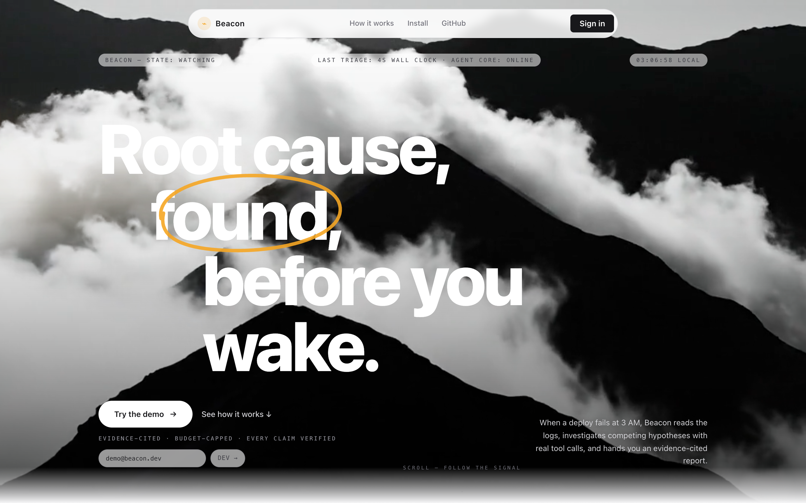
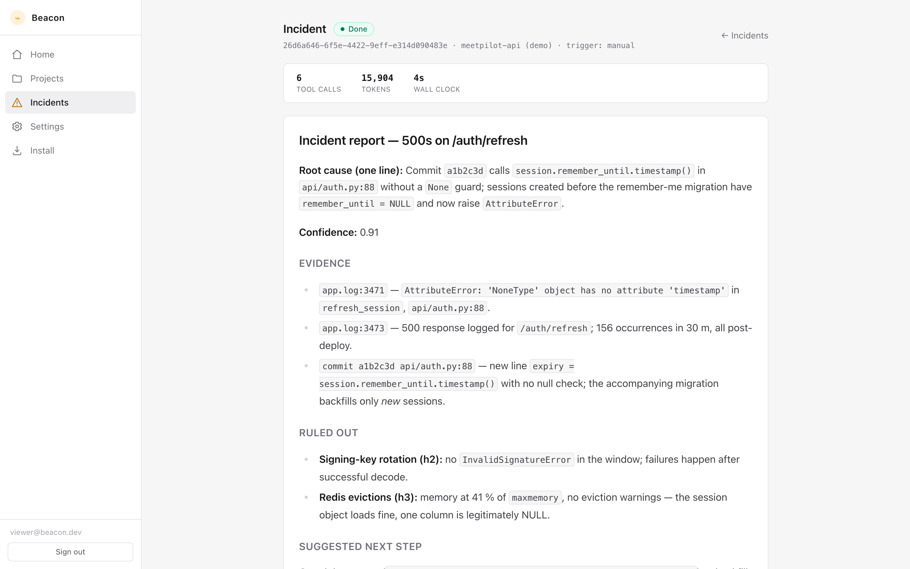
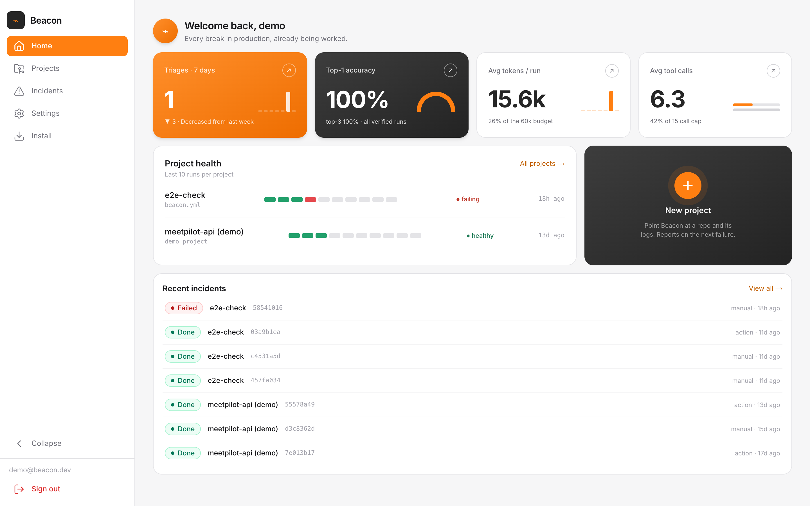

# Beacon

**AI incident triage for on-call engineers.** When a deploy fails at 3 AM,
Beacon reads the logs, metrics, and recent commits, investigates competing
root-cause hypotheses with real tool calls, and hands you an evidence-cited
report — before you have opened a terminal.



## How it works

1. **Collect** — clusters the trailing log window, flags brand-new error
   templates, and pulls recent deploy diffs; ~50K lines compressed to signal.
2. **Investigate** — generates competing root-cause hypotheses, then verifies
   each with real tool calls (`search_logs`, `read_diff`, `get_metric`) under
   a hard per-incident budget (tool calls and tokens both capped).
3. **Report** — delivers an evidence-cited report: root cause, confidence,
   what was ruled out and why, with every citation deterministically verified.

Reports land in the dashboard, and optionally in your inbox and on the
failing pull request via the [GitHub Action](INSTALL.md).



## Five-minute quickstart

Prerequisites: Docker with Compose.

```bash
git clone https://github.com/harshcodesss/Beacon.git
cd Beacon
cp .env.example .env   # defaults work out of the box for local demo
docker compose up --build
```

Compose boots five services: Postgres, Redis, the FastAPI API (`:8000`,
migrations run automatically), the RQ triage worker, and the Next.js web app
(`:3000`).

Then walk the demo path:

1. Open <http://localhost:3000> and use **Dev sign-in** (enabled by
   `AUTH_DEV_MODE=true`; any email works, no GitHub account needed).
2. You land on **Home** with a seeded demo project — finished incidents,
   accuracy stats, and one failed run, so no screen is ever empty.
3. Under **Projects**, create a project, open it, then **Trigger incident**.
4. Watch the incident page poll live from *Queued* → *Running* → *Done*; the
   report renders with verdicts (accept/reject badges, confidence bars,
   evidence chips) and the hypothesis set the agent worked from.



To sign in with GitHub instead, create a GitHub OAuth app (Settings →
Developer settings → OAuth Apps) with callback URL
`http://localhost:3000/api/auth/callback/github`, set
`GITHUB_CLIENT_ID` / `GITHUB_CLIENT_SECRET` in `.env`, and set
`AUTH_DEV_MODE=false`.

## GitHub Action

Beacon can triage automatically when your deploy workflow fails and comment
the report on the triggering pull request. **You bring your own Gemini API key
and pick the model.** Install guide with a copy-paste workflow:
**[INSTALL.md](INSTALL.md)**.

## Model efficiency

**Bring your own LLM.** The pipeline runs on any LangChain-supported provider
via a provider-prefixed model string — set `BEACON_MODEL` and the matching
provider key:

```bash
BEACON_MODEL=google_genai:gemini-3.1-flash-lite   # + GEMINI_API_KEY / GOOGLE_API_KEY
BEACON_MODEL=openai:gpt-4o                         # + OPENAI_API_KEY
BEACON_MODEL=anthropic:claude-sonnet-5             # + ANTHROPIC_API_KEY
```

Model choice is a cost/quality knob — the Investigator makes ~85–90% of the
calls, so the cheapest lever is running a strong model on the two single-shot
calls (Generator, Reporter) and a lite model on the call-heavy Investigator
loop. Set that split with the per-agent overrides (`BEACON_GENERATOR_MODEL` /
`BEACON_INVESTIGATOR_MODEL` / `BEACON_REPORTER_MODEL`).

Measured on one frozen incident (a payment-timeout fault), instrumented per
agent. **n=1 per config — directional, not statistical.**

| Config | Judge top-1 | LLM calls | Input tokens | Citation validity | Notes |
| --- | --- | --- | --- | --- | --- |
| **Mixed** — 3.5-flash gen+rep, 3.1-flash-lite investigator | ✅ correct | 20 | 117K | 100% | best quality-per-cost |
| **All 3.1-flash-lite** | ❌ missed | 12 | 64K | 100% | cheapest; weaker hypotheses |
| **All strong-flash** | — | — | — | — | 503-unavailable at test time* |

\* The newest strong models (`gemini-3.5-flash`, `gemini-3-flash-preview`)
returned `503 UNAVAILABLE` under load across repeated attempts, while the lite
model completed every run — a real availability argument for the mixed config.
Two operational findings: (1) pinning triage to the newest model is a
reliability risk; (2) failed 503 retries still consume daily quota. Cost per
triage is bounded by the tool-call budget (15 calls typical, ~28 max).

Fuller methodology and the per-agent call/token breakdown live in
[`docs/report_agentic.md`](docs/report_agentic.md).

## Architecture

```
Next.js 14 (App Router) ── NextAuth (GitHub / dev) ─┐
        │  Bearer JWT                               │ access-token exchange
        ▼                                           ▼
FastAPI ──────────────────────────────── POST /auth/oauth/callback
  │   │
  │   └── POST /projects/{id}/incidents ──► Redis (RQ "triage" queue)
  │                                              │
  ▼                                              ▼
Postgres ◄────────────────────────────── worker: beacon graph invoke
  ▲                                       (real agent core; mock fallback
  │                                        when no Gemini key is present)
  └── POST /webhook/github  ◄──────────── GitHub Action (BYO Gemini key)
```

- **Agent boundary** — the product shell integrates through one line:
  `from beacon.graph.build import app as beacon_graph`. The `beacon/` package
  ships inside the backend and Action images; `backend/app/beacon_client.py`
  auto-detects it and `/healthz` reports `agent_core: "real"`. It falls back to
  a mock with the identical `invoke()` contract when the package or a Gemini
  key is absent, so a keyless demo still works.
- **Auth** — NextAuth on the frontend; the backend verifies the GitHub
  access token against the GitHub API and issues its own JWT. All queries are
  user-scoped (missing and foreign resources are both 404).
- **API keys** — `beacon_sk_` keys are stored SHA-256-hashed, shown once at
  creation, and rate-limited per key on the webhook.
- **Jobs** — RQ worker; a failed triage marks the incident *failed* and
  stores the error with the incident, never crashing the worker.

## Development

Backend (Python 3.11+):

```bash
cd backend
python -m venv .venv && .venv/bin/pip install -r requirements.txt -r requirements-dev.txt
.venv/bin/ruff check .
.venv/bin/python -m pytest --cov
```

Frontend (Node 20+):

```bash
cd frontend
npm install
npm run typecheck && npm run lint && npm test
npm run dev
```

CI runs the same lint/test/build matrix on every pull request
(`.github/workflows/ci.yml`).

## Repository layout

```
beacon/     Agent core: 5-agent LangGraph pipeline (collector, generator,
            investigator, reporter) + eval harness (judge). The only public
            entry point is beacon.graph.build.app
backend/    FastAPI app, SQLAlchemy models, Alembic migrations, RQ jobs, tests
frontend/   Next.js app: landing + sidebar shell (home, projects, incidents,
            settings, install)
action/     GitHub Action (Docker) that triages failed deploys
tests/      Agent-core test suite (pytest)
.github/    CI workflow and README assets
```

## Out of scope (v1)

Billing, teams, Slack delivery, Loki/Prometheus adapters, auto-remediation,
multi-user projects. Every decision is biased toward the demo path:
sign in → create project → trigger incident → report appears.
